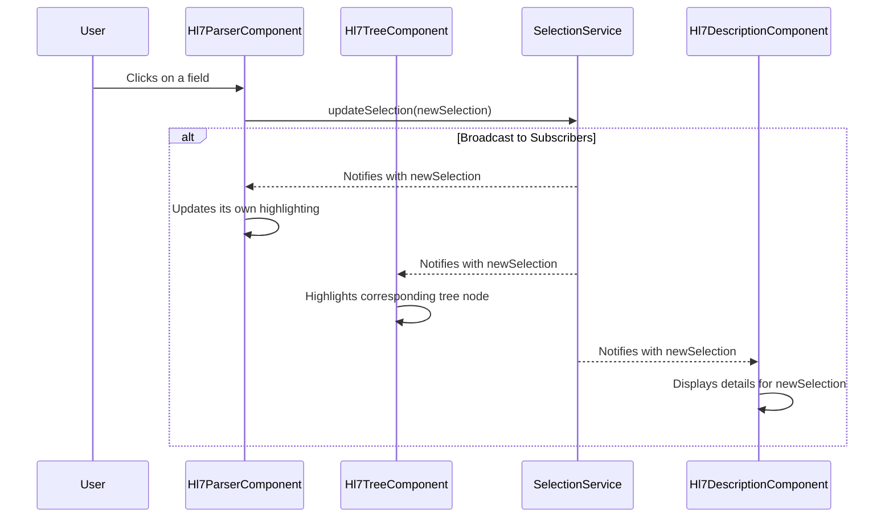

# Component Synchronization

This document explains the synchronization mechanism that keeps the `Hl7ParserComponent`, `Hl7TreeComponent`, and `Hl7DescriptionComponent` in sync when a user selects an item.

## Overview

To ensure a seamless user experience, a selection in one component (e.g., clicking a field in the raw message view) must be instantly reflected in all other components. This is achieved using a shared Angular service (`SelectionService`) that acts as a centralized state manager for the user's selection.

This approach avoids complex and direct parent-child communication, leading to a more decoupled and maintainable architecture.

## The `SelectionService`

The `SelectionService` is an injectable Angular service that holds the currently selected item. It exposes two key methods:

-   **`getSelection()`**: An `Observable` that components can subscribe to in order to receive real-time updates whenever the selection changes.
-   **`updateSelection(selection)`**: A method that allows any component to broadcast a new selection to all subscribed components.

## Synchronization Workflow

The synchronization process follows a clear, unidirectional data flow pattern, mediated by the `SelectionService`.

1.  **Initialization:**
    -   The `AppComponent` initializes the `Hl7ParserComponent`, `Hl7TreeComponent`, and `Hl7DescriptionComponent`.
    -   Each of these components injects the singleton instance of `SelectionService`.
    -   Each component subscribes to the `getSelection()` observable to listen for changes.

2.  **User Interaction:**
    -   A user clicks on an element in either the `Hl7ParserComponent` (the raw text view) or the `Hl7TreeComponent`.

3.  **Update Selection:**
    -   The component where the interaction occurred calls the `selectionService.updateSelection()` method, passing in the new selection object.

4.  **Broadcast and State Update:**
    -   The `SelectionService` broadcasts the new selection object to all components that have subscribed to its `getSelection()` observable.
    -   Upon receiving the new selection, each component updates its internal state to reflect the change (e.g., by highlighting the corresponding element).

### Workflow Diagram

The following diagram illustrates the data flow when a user clicks an item in the `Hl7ParserComponent`. The same workflow applies when the interaction originates from the `Hl7TreeComponent`.

This service-based approach ensures that all components are always in sync without needing to be directly aware of each other, promoting a clean and scalable architecture.
