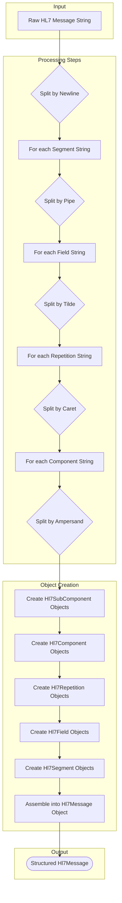

# HL7 Parsing Implementation

This document outlines the implementation of the HL7 parsing logic within the `ng-hl7-parser` library. The core of the parsing functionality resides in the `Hl7ParserService`.

## Overview

The parsing process is designed to be simple and robust, transforming a raw HL7 message string into a structured, hierarchical object that can be easily consumed by other components. The process relies on a series of string-splitting operations based on the standard HL7 delimiters.

The final output is an `Hl7Message` object, which contains an array of `Hl7Segment` objects and a list of any parsing errors encountered.

## Data Model

The parsed message is represented by a set of interfaces defined in `hl7.model.ts`:

-   **`Hl7Message`**: The root object, containing all segments and errors.
-   **`Hl7Segment`**: Represents a single segment (e.g., MSH, PID, OBX). Contains an array of `Hl7Field` objects.
-   **`Hl7Field`**: Represents a field within a segment. Contains an array of `Hl7Repetition` objects.
-   **`Hl7Repetition`**: Represents a repetition of a field. Contains an array of `Hl7Component` objects.
-   **`Hl7Component`**: Represents a component within a field. Contains an array of `Hl7SubComponent` objects.
-   **`Hl7SubComponent`**: The lowest level of the hierarchy, representing a sub-component.

## Parsing Workflow

The `Hl7ParserService.parse()` method executes the following steps to process the message.

### 1. Initial Validation

The service first checks if the message is valid by ensuring it is not empty and starts with the required `MSH` segment. If not, it returns an error.

### 2. Segment Splitting

The raw message string is split by the newline character (`\n`) to separate it into individual segment strings.

### 3. Hierarchical Parsing

Each segment string is then processed to build the hierarchical structure. This is done by splitting the string based on the standard HL7 delimiters in the following order:

1.  **Fields:** The segment string is split by the pipe (`|`) character.
2.  **Repetitions:** Each resulting field string is split by the tilde (`~`) character.
3.  **Components:** Each resulting repetition string is split by the caret (`^`) character.
4.  **Sub-Components:** Each resulting component string is split by the ampersand (`&`) character.

Each split part is wrapped in its corresponding data model object (e.g., `Hl7Field`, `Hl7Component`), preserving the original string value at each level.

### Workflow Diagram

The following diagram illustrates the complete parsing workflow from a raw string to a structured `Hl7Message` object.

This structured approach ensures that every part of the HL7 message is captured in a predictable and easy-to-navigate object model, which is then used by the viewer components to render the message and its details.
